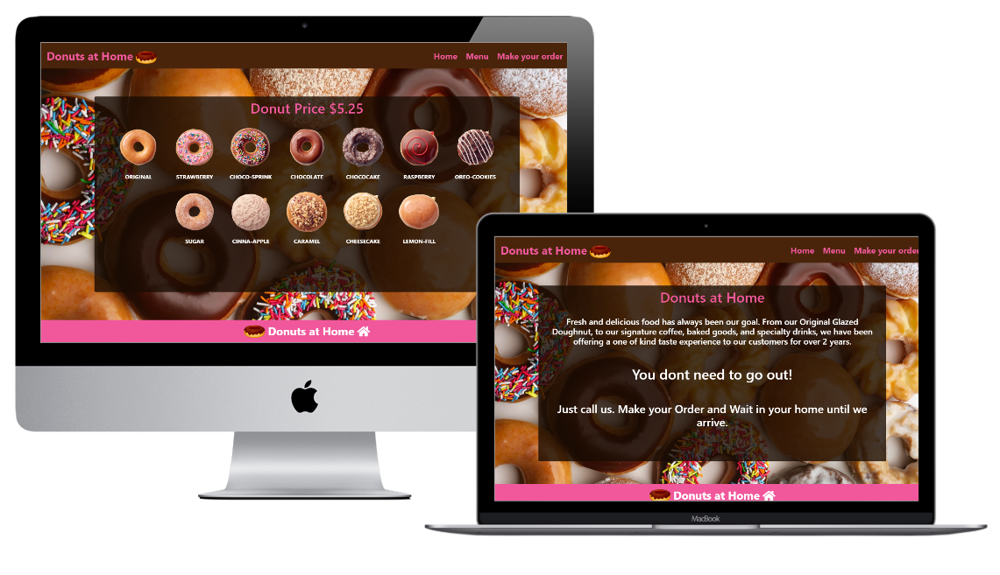

# Restaurant  Project

A stylish website menu for a donuts store.

# Live Demo

[Live demo](https://salvador-on.github.io/RestaurantPage/)

# What it does

- The website includes 1 page with 3 tabs buttons that change the content of the central container to display different information using JavaScript modules.

## Author

**Salvador Olvera**
- Linkedin: [Salvador Olvera](https://www.linkedin.com/in/salvador-olvera-n)
- Github: [@Salvador-ON](https://github.com/Salvador-ON)
- Twitter: [@Salvador Olvera_ON](https://twitter.com/Salvador_ON) 

## Contributing

This is a project for educational purposes only. We are not accepting contributions.

## Show your support

Give a ⭐️ if you like this project!

## Enjoy!
